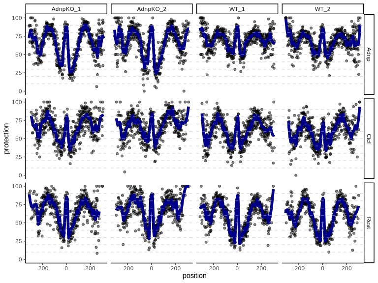
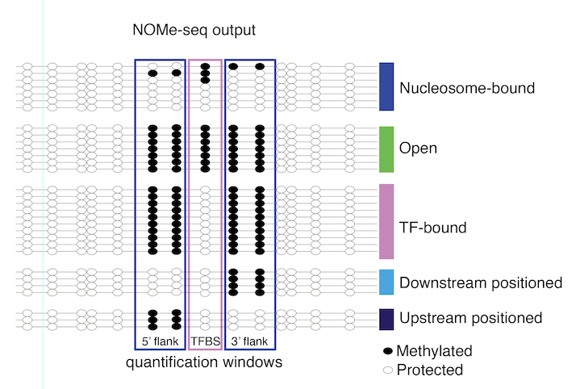
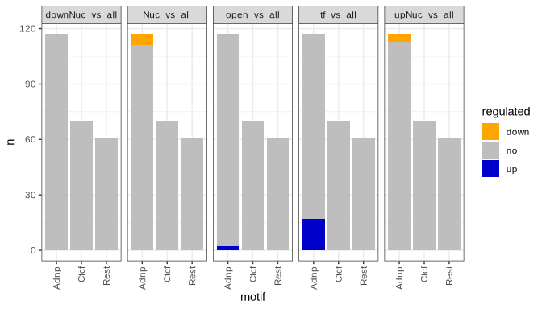
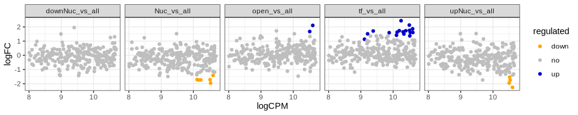
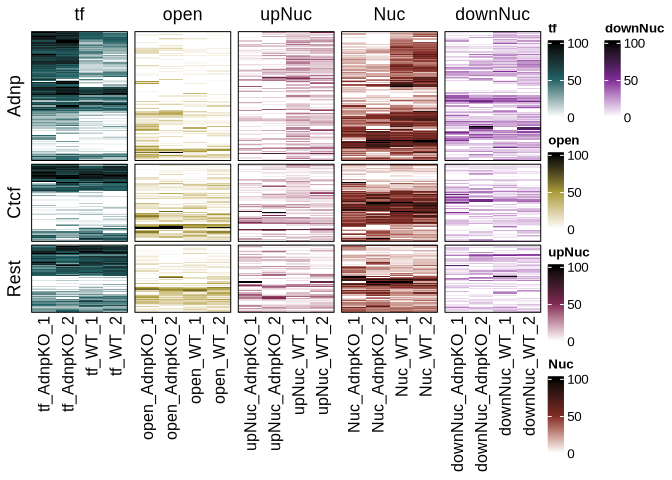
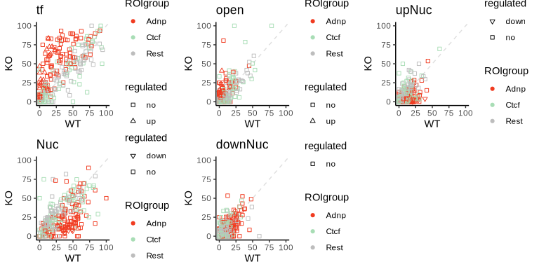

<!-- README.md is generated from README.Rmd. Please edit that file -->

# dinoR

<!-- badges: start -->
<!-- badges: end -->

The goal of dinoR is to facilitate differential NOMe-seq data analysis.

## Installation

You can install the development version of dinoR from
[GitHub](https://github.com/) with:

``` r
BiocManager::install("fmi-basel/gbuehler-dinoR", subdir = "dinoR")
```

then we can load dinoR and other necessary packages:

``` r
suppressPackageStartupMessages({
  library(dinoR)
  library(ggplot2)
  library(dplyr)
  library(SummarizedExperiment)
  })
```

### Load the NOMe-seq data for Adnp Knock-Out and WT mouse ES cells (two replicates each)

We use [biscuit](https://huishenlab.github.io/biscuit/) to map 300bp
paired-end reads to the genome,
[UMI-tools](https://github.com/CGATOxford/UMI-tools) to remove
duplicated UMIs, and the [fetch-NOMe
package](https://github.com/fmi-basel/gpeters-fetchNOMe) to get the
protection from GCH methylation calls for each read pair (fragment)
overlapping a region of interest (ROI). The ROIs provided to fetchNOMe
should all be centered around a transcription factor motif. Note that we
use protection from methylation calls (0 = methylated, 1 = not
methylated). We then use the R package
[NOMeConverteR](https://github.com/fmi-basel/gbuehler-NOMeConverteR) to
convert the resulting tibble into a ranged summarized experiment object.
This represents an efficient way of sharing NOMe-seq data.

``` r
NomeData <- readRDS(system.file("extdata", "NOMeSeqData.rds", package = "dinoR"))
NomeData
#> class: RangedSummarizedExperiment 
#> dim: 267 4 
#> metadata(0):
#> assays(5): nFragsFetched nFragsNonUnique nFragsBisFailed nFragsAnalyzed
#>   reads
#> rownames(267): Adnp_chr8_47978653_47979275
#>   Adnp_chr6_119394879_119395501 ... Rest_chrX_7794908_7795530
#>   Rest_chr7_64704080_64704702
#> rowData names(1): motif
#> colnames(4): AdnpKO_1 AdnpKO_2 WT_1 WT_2
#> colData names(2): samples group
```

The reads assay contains GPos objects with the GCH methylation data in
two sparse logical matrices, one for protection from methylation , and
one for methylation.

``` r
assays(NomeData)[["reads"]][1,1]
#> [[1]]
#> UnstitchedGPos object with 623 positions and 2 metadata columns:
#>         seqnames       pos strand |            protection           methylation
#>            <Rle> <integer>  <Rle> |           <lgCMatrix>           <lgCMatrix>
#>     [1]     chr8  47978653      + | FALSE:FALSE:FALSE:... FALSE:FALSE:FALSE:...
#>     [2]     chr8  47978654      + | FALSE:FALSE:FALSE:... FALSE:FALSE:FALSE:...
#>     [3]     chr8  47978655      + | FALSE:FALSE:FALSE:... FALSE:FALSE:FALSE:...
#>     [4]     chr8  47978656      + | FALSE:FALSE:FALSE:... FALSE:FALSE:FALSE:...
#>     [5]     chr8  47978657      + | FALSE:FALSE:FALSE:... FALSE:FALSE:FALSE:...
#>     ...      ...       ...    ... .                   ...                   ...
#>   [619]     chr8  47979271      + | FALSE:FALSE:FALSE:... FALSE:FALSE:FALSE:...
#>   [620]     chr8  47979272      + | FALSE:FALSE:FALSE:... FALSE:FALSE:FALSE:...
#>   [621]     chr8  47979273      + | FALSE:FALSE:FALSE:... FALSE:FALSE:FALSE:...
#>   [622]     chr8  47979274      + | FALSE:FALSE:FALSE:... FALSE:FALSE:FALSE:...
#>   [623]     chr8  47979275      + | FALSE:FALSE:FALSE:... FALSE:FALSE:FALSE:...
#>   -------
#>   seqinfo: 53 sequences from an unspecified genome; no seqlengths
```

## Meta plots across ROIs with common TF motifs in the center

We generate metaplots, grouping our ROIs into those that have Rest,
Ctcf, or Adnp bound to the motifs in their center. We use 2 samples from
WT mouse ES cells, and two samples from Adnp KO mouse ES cells. We
exclude any ROI - sample combinations which contain less than 10 reads
(nr=10).

``` r
avePlotData <- metaPlots(NomeData=NomeData,nr=10,ROIgroup = "motif")

#plot average plots
ggplot(avePlotData, aes(x=position,y=protection)) + geom_point(alpha=0.5) + 
    geom_line(aes(x=position,y=loess),col="darkblue",lwd=2) + 
    theme_classic() + facet_grid(rows = vars(type),cols= vars(sample), scales = "free") +
    ylim(c(0,100)) + geom_hline(yintercept = c(10,20,30,40,50,60,70,80,90),
                                alpha=0.5,color="grey",linetype="dashed")
```



We can already see that while the NOMe footprints around Rest and Ctcf
bound motifs don’t change, there are clear differences between WT and
Adnp KO cells around the Adnp bound motifs.

## Determine fragment counts for five chromatin patterns: TF, open, upNuc, downNuc, Nuc

To quantify the differences visible in above meta plots, we adopted and
slightly modified the approch of Sönmezer et al., 2021. We classify each
fragment according to five types of footprints: transcription factor
bound (TF), open chromatin, and nucleosome (we distinguish also upstream
positioned nucleosome (upNuc), downstream positioned nucleosome
(downNuc), and all other nucleosome (Nuc) footprints). To do this we use
three windows (-50:-25, -8:8, 25:50) around the motif center (which
should correspond to the ROI center of the provided ROIs). Then we count
the number of fragments in each sample-ROI combination supporting each
footprint category.

<figure>

<figcaption aria-hidden="true">NOMe patterns</figcaption>
</figure>

``` r
NomeData <- footprintCalc(NomeData)
NomeData <- footprintQuant(NomeData)
NomeData
#> class: RangedSummarizedExperiment 
#> dim: 267 4 
#> metadata(0):
#> assays(12): nFragsFetched nFragsNonUnique ... downNuc all
#> rownames(267): Adnp_chr8_47978653_47979275
#>   Adnp_chr6_119394879_119395501 ... Rest_chrX_7794908_7795530
#>   Rest_chr7_64704080_64704702
#> rowData names(1): motif
#> colnames(4): AdnpKO_1 AdnpKO_2 WT_1 WT_2
#> colData names(2): samples group
```

Note that if a fragment does not have methylation protection data in all
three windows needed for classification, the fragment will not be used.

Next we can test for differential abundance of footprints between Adnp
KO and WT samples.

## Calculate differential NOMe-seq footprint abundance between Adnp KO and WT

We use edgeR to check for differences in abundance between wild type and
Adnp KO samples for each footprint type fragment count compared to the
total fragment counts. Library sizes for TMM normalization are
calculated on the total fragment counts.

``` r
res <- diNOMeTest(NomeData,WTsamples = c("WT_1","WT_2"),
  KOsamples = c("AdnpKO_1","AdnpKO_2"))
res
#> # A tibble: 1,240 × 10
#>     logFC logCPM     F      PValue       FDR contrasts   ROI    motif logadjPval
#>     <dbl>  <dbl> <dbl>       <dbl>     <dbl> <chr>       <chr>  <chr>      <dbl>
#>  1  2.11   10.6  27.3  0.000000193 0.0000478 open_vs_all Adnp_… Adnp       4.32 
#>  2  1.68   10.5  16.5  0.0000491   0.00609   open_vs_all Adnp_… Adnp       2.22 
#>  3  1.52   10.0   9.36 0.00224     0.185     open_vs_all Adnp_… Adnp       0.732
#>  4  1.21    8.97  8.62 0.00336     0.199     open_vs_all Adnp_… Adnp       0.701
#>  5 -1.47   10.2   8.20 0.00423     0.199     open_vs_all Ctcf_… Adnp       0.701
#>  6  1.03   10.2   7.96 0.00481     0.199     open_vs_all Adnp_… Adnp       0.701
#>  7  1.13    9.88  6.84 0.00899     0.318     open_vs_all Adnp_… Adnp       0.497
#>  8  1.32   10.5   5.72 0.0169      0.523     open_vs_all Adnp_… Adnp       0.281
#>  9  1.06   10.7   5.51 0.0190      0.523     open_vs_all Adnp_… Adnp       0.281
#> 10  0.994  10.4   4.83 0.0281      0.633     open_vs_all Adnp_… Adnp       0.199
#> # ℹ 1,230 more rows
#> # ℹ 1 more variable: regulated <chr>
```

We can then simply plot the number of regulated ROIs within each ROI
type…

``` r

res %>% group_by(contrasts,motif,regulated) %>% summarize(n=n()) %>% 
  ggplot(aes(x=motif,y=n,fill=regulated)) + geom_bar(stat="identity") + 
  facet_grid(~contrasts) + theme_bw() + 
  theme(axis.text.x = element_text(angle = 90, vjust = 0.5, hjust=1)) + 
  scale_fill_manual(values=c("orange","grey","blue3"))
#> `summarise()` has grouped output by 'contrasts', 'motif'. You can override
#> using the `.groups` argument.
```



…or display the results in MA plots.

``` r
ggplot(res,aes(y=logFC,x=logCPM,col=regulated)) + geom_point() + 
  facet_grid(~contrasts) + theme_bw() + 
  scale_color_manual(values=c("orange","grey","blue3"))
```



## Calculate the percentage of fragments in each footprint type and plot a (clustered) heatmap comparing percentages in WT and Adnp KO

``` r
footprint_percentages <- footprintPerc(NomeData)
fpPercHeatmap(footprint_percentages)
```



## Compare the footprint percentages and significance testing results for Adnp KO and WT

``` r

compareFootprints(footprint_percentages,res,WTsamples = c("WT_1","WT_2"),
                  KOsamples = c("AdnpKO_1","AdnpKO_2"),plotcols = c("#f03b20", "#a8ddb5", "#bdbdbd"))
```



We can see that in Adnp KO samples, transcription factor footprints
significantly increase around Adnp motifs, while nucleosome footprints
decrease.
